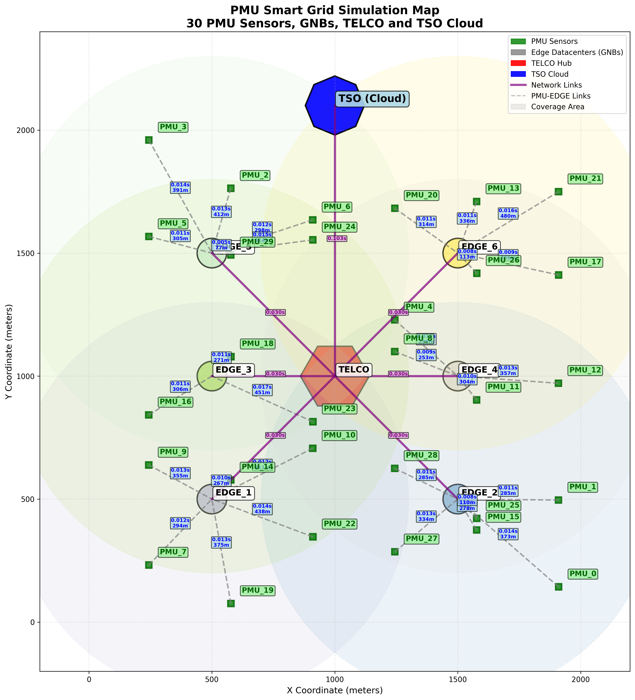
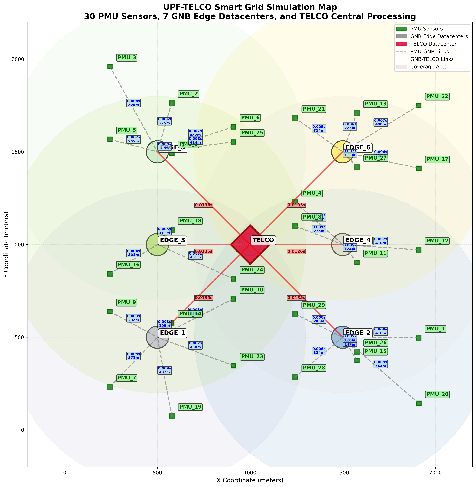
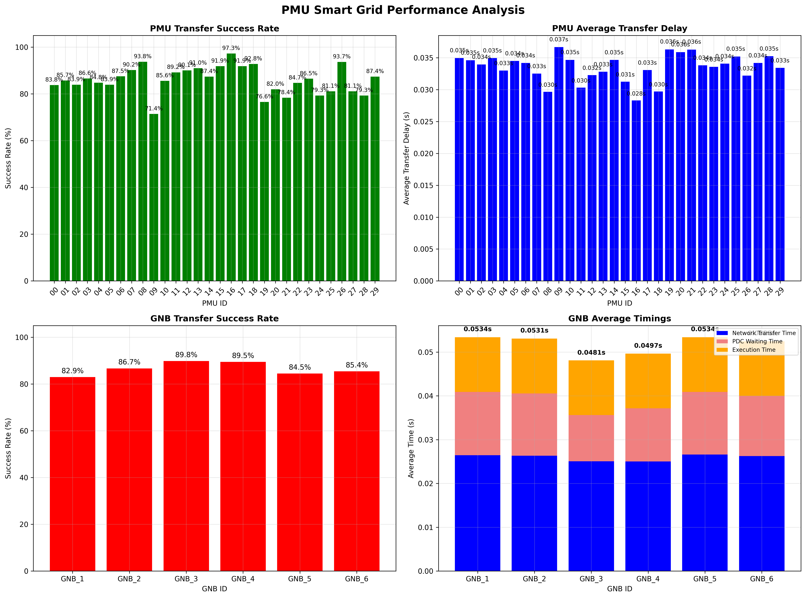
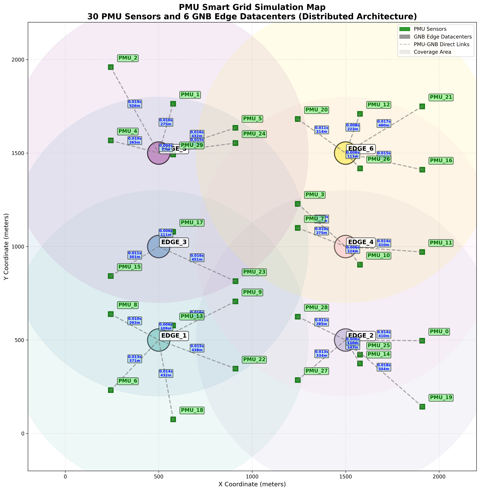
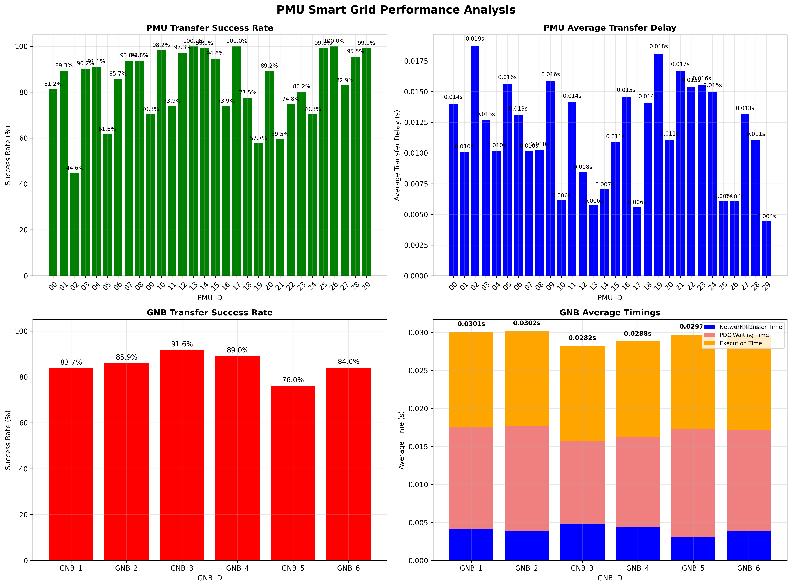
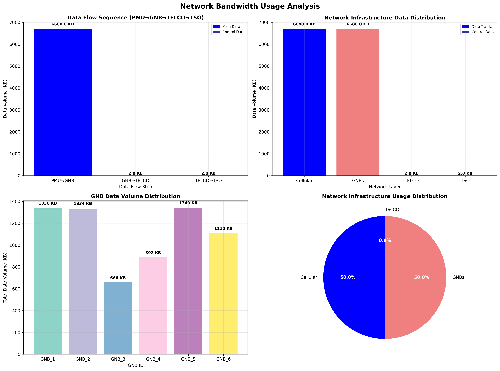

# PMU Smart Grid Simulation System

## 🔋 Overview

This system simulates a **Smart Grid Power Monitoring Network** using **PMU (Phasor Measurement Unit) sensors** that send data to different **PDC (Phasor Data Concentrator)** locations for real-time grid analysis. The system models realistic network delays, distance-based routing, and dynamic data collection with **3 different deployment scenarios**.

## 🌟 Three Deployment Scenarios

### **Scenario 1: UpfOnTelco_PdcOnCloud** (Script: s1_sim.sh)
- **UPF Location**: TELCO Hub  
- **PDC Location**: TSO Cloud
- **Data Flow**: PMU → GNB → TELCO → TSO (PDC processing) → Results
- **Characteristics**: Centralized processing, highest latency, cloud scalability

| Network Map | Performance Analysis | Network Usage |
|-------------|---------------------|---------------|
|  |  |  |

### **Scenario 2: UpfOnTelco_PdcOnEdge** (Script: s2_sim.sh)
- **UPF Location**: TELCO Hub
- **PDC Location**: Edge Datacenters (GNBs)
- **Data Flow**: PMU → GNB → TELCO → back to GNB (PDC processing) → Results
- **Characteristics**: Hybrid approach, GNB processing with TELCO routing

| Network Map | Performance Analysis | Network Usage |
|-------------|---------------------|---------------|
|  |  |  |

### **Scenario 3: UpfOnEdge_PdcOnEdge** (Script: s3_sim.sh)
- **UPF Location**: Edge Datacenters (GNBs)
- **PDC Location**: Edge Datacenters (GNBs) 
- **Data Flow**: PMU → GNB (PDC processing) → Results
- **Characteristics**: Lowest latency, distributed processing

| Network Map | Performance Analysis | Network Usage |
|-------------|---------------------|---------------|
|  |  |  |

## 🎯 Core Concept

**PMU Sensors → GNB/Edge Datacenters → TELCO → TSO Cloud**

1. **Multiple PMU sensors** send **synchronized measurements** periodically
2. **Distance-based routing** selects the closest GNB for each PMU
3. **Dynamic collection windows** gather PMU data with configurable waiting latency
4. **Grid Analysis tasks** are processed at different locations based on scenario
5. **Realistic network simulation** with hop-by-hop delays and distances

---

## 🏗️ System Architecture

### 📊 Data Flow (varies by scenario)
```
Scenario 1: PMU → GNB → TELCO → TSO (PDC) → Results
Scenario 2: PMU → GNB → TELCO → GNB (PDC) → Results  
Scenario 3: PMU → GNB (PDC) → Results
```

### 🌐 Network Topology
```
PMU Sensors → GNB (Edge) → TELCO (Hub) → TSO (Cloud)
    ↑               ↑            ↑           ↑
   5G/LTE      MAN Network   MAN Network   WAN Network
```

---

## 🔧 Core Components

### 1. **PmuSimulation.java** - Main Entry Point
- Loads configuration from XML files
- Sets up custom components (NetworkModel, TaskGenerator, etc.)
- Executes post-simulation analysis

### 2. **Network Models** - Scenario-Specific Routing
- **CloudNetworkModel.java**: For Scenario 1 (Cloud processing)
- **TelcoNetworkModel.java**: For Scenario 2 (TELCO routing + Edge processing)
- **EdgeNetworkModel.java**: For Scenario 3 (Edge processing)
- **Distance-based GNB selection** and **hop-by-hop calculations**

### 3. **PmuDataCollectorDynamic.java** - Smart Data Collection
- **Generation time grouping**: Tasks with same generation time together
- **Configurable waiting latency**: Timeout for late arrivals
- **Deadline enforcement**: DEADLINE_MISSED for late PMU data

### 4. **PmuLogger.java** - Comprehensive Logging
- **Dual CSV outputs**: PMU data transfers + Grid Analysis tasks
- **Hop-by-hop details**: Network path with times and distances
- **Statistics generation**: Scenario-specific performance metrics

### 5. **Analysis Scripts** - Post-Simulation Visualization
- **CloudLogAnalysis.py**: Analysis for Scenario 1
- **TelcoLogAnalysis.py**: Analysis for Scenario 2  
- **EdgeLogAnalysis.py**: Analysis for Scenario 3

---

## 📈 Simulation Results

Each scenario generates:

### CSV Data Files
- **`Sequential_simulation_pmu.csv`**: PMU data transfers with hop details
- **`Sequential_simulation_state_estimation.csv`**: Grid Analysis task results

### Analysis Results
- **`[scenario]_simulation_map.png`**: Network topology visualization
- **`performance_analysis_charts.png`**: Performance comparison charts
- **`network_bandwidth_usage_charts.png`**: Network utilization analysis
- **`pmu_simulation_statistics.txt`**: Comprehensive performance metrics

---

## 🎛️ Key Configuration

### Simulation Parameters
```properties
# PMU Configuration
min_number_of_edge_devices=30
max_number_of_edge_devices=30

# Network Area
length=2000  # meters
width=2000   # meters

# Collection Parameters
max_pdc_waiting_time=0.0449  # seconds
pmu_measurement_rate=1       # measurements per second
```

### Network Infrastructure
- **PMU Sensors**: Configurable count and positions
- **GNB Edge Datacenters**: 4 edge locations with coverage areas
- **TELCO Hub**: Central telecommunications hub
- **TSO Cloud**: Transmission system operator cloud

---

## 🚀 Quick Start

See [QUICK_START.md](QUICK_START.md) for step-by-step execution instructions for all 3 scenarios.

---

## 📊 Performance Comparison

The system allows comparison of the three scenarios across:
- **Network Latency**: End-to-end transfer times
- **Processing Delays**: PDC processing location impact
- **Deadline Compliance**: On-time delivery rates
- **Resource Utilization**: Network and computational resources
- **Scalability**: Performance under different PMU counts

Each scenario provides insights into smart grid deployment trade-offs between latency, processing power, and network utilization.
